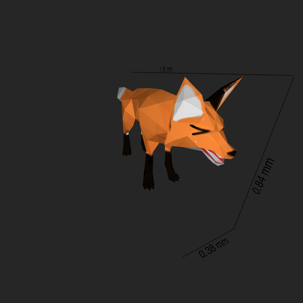
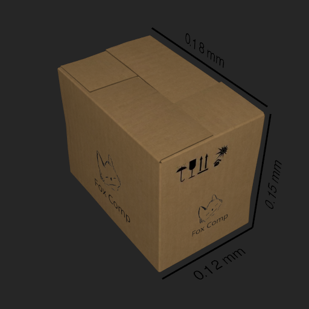
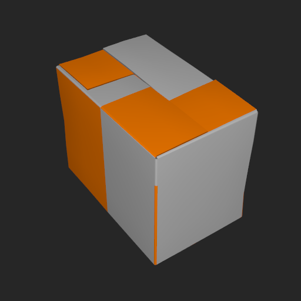

# Implementation

The rendering is done purely via Vulkan and GLSL shaders. The main problem of design was mainly architecture to properly organize all required components into a manageable way. Smaller details are about making the text and lines positioned and rendered correctly. Best positions are chosen depending on simple math that guarantees the best visibility on the screen by calculating how much area the text takes on the final image. The position that has the most visible area is considered the best. It allows for text to easily adapt between different angles and FOVs. Also made sure the program can correctly be called from anywhere without being called specifically from working directory. The shader has simple shading to help easily tell the shape of the object. The shading is only available for objects that have normals included.

# Examples of renders

Render of a fox object with high FOV: 
 

Render of a box from further away but with higher FOV:
 

Render of the same box, but no texture provided and sizes are disabled:
 

### Points of interest

- src/renderer : Whole design - The whole class was separated into its logical components without introducing too much decoupling.
- src/geometrygenerator.h : Algorithm - Chooses placement of dimensions by calculating visibility on the rendered image.
- src/parser/obj.hpp : Callback pattern - Allows to easily reuse the same logic for line-by-line formats.
